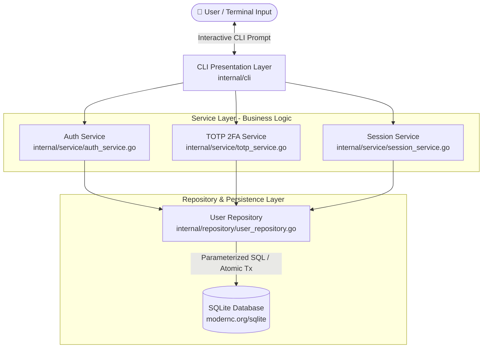
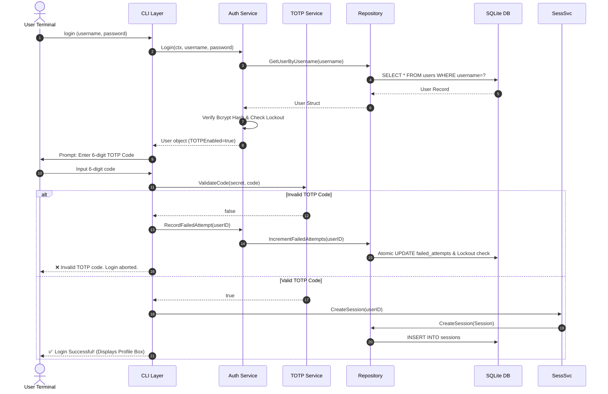

# 🔐 Containerized Go CLI Login System with Optional 2FA

A secure, enterprise-grade command-line login system built in Go. Features user registration, authentication, optional TOTP-based two-factor authentication (Google Authenticator compatible), session management, atomic account lockout protection, and containerized SQLite storage.

---

## 🏗️ System Architecture

The application follows a **Decoupled Multi-Tier Layered Architecture** adhering to clean code and SOLID principles. 



### 🔁 Sequence Diagram: 2FA Authentication Flow



---

## 🏛️ Architectural Layer Breakdown

1. **CLI Presentation Layer (`internal/cli`)**:
   - Manages interactive input loops (`bufio.Scanner`).
   - Hides sensitive password keystrokes via `golang.org/x/term`.
   - Renders terminal ASCII QR codes using `qrterminal` for 2FA onboarding.
   - Filters control escape sequences (e.g. arrow keys) via input sanitization.

2. **Service Business Logic (`internal/service`)**:
   - **`AuthService`**: Handles user registration, password strength validation, timing-attack resistance, and failed attempt recording.
   - **`TOTPService`**: Generates TOTP secrets, produces provisioning URIs, and validates 6-digit time-based tokens (`pquerna/otp`).
   - **`SessionService`**: Issues UUID v4 session tokens with expiration tracking.

3. **Data Access Repository (`internal/repository`)**:
   - Encapsulates all SQL execution using safe parameterized queries (`?`).
   - Manages atomic transactions (`db.BeginTx`) for failure counting and account lockouts.

4. **Database & Storage Layer (`internal/db`)**:
   - Embedded pure-Go CGO-free SQLite driver (`modernc.org/sqlite`).
   - Enabled WAL (Write-Ahead Logging) journal mode and foreign key constraints.
   - Auto-executes idempotent schema migrations on startup.

---

## ✨ Key Features

- **User Registration**: Create accounts with strict username and password complexity rules.
- **Bcrypt Password Security**: Configurable cost factor with timing-attack mitigation.
- **Google Authenticator 2FA**: Standard TOTP RFC 6238 implementation with in-terminal QR code rendering.
- **Atomic Account Lockout**: Locks accounts automatically after 5 failed login attempts for 15 minutes.
- **2FA Brute-Force Defense**: Failed 2FA attempts count towards the account lockout threshold.
- **Session Revocation**: Existing sessions are invalidated automatically whenever 2FA status is changed.
- **FileSystem Security**: Strict file (`0600`) and directory (`0700`) permissions for database files.
- **Containerization**: Fully containerized using Docker multi-stage builds and Docker Compose persistence volumes.

---

## 📁 Project Structure

```
.
├── cmd/
│   └── cli/
│       └── main.go                 # Application entry point
├── internal/
│   ├── config/
│   │   └── config.go              # Environment-based configuration
│   ├── cli/
│   │   └── cli.go                 # Interactive CLI presentation & command router
│   ├── db/
│   │   ├── db.go                  # SQLite initialization & WAL mode setup
│   │   ├── db_test.go             # Database connection & migration tests
│   │   └── migrations.go          # Embedded SQL schema migrations
│   ├── models/
│   │   ├── user.go                # User & Session domain structs
│   │   └── user_test.go           # Struct logic tests
│   ├── repository/
│   │   ├── user_repository.go     # Repository layer (parameterized queries & tx)
│   │   └── user_repository_test.go# Repository unit tests
│   └── service/
│       ├── auth_service.go        # Authentication & registration service
│       ├── auth_service_test.go   # Auth service unit tests
│       ├── session_service.go     # Session management service
│       ├── totp_service.go        # TOTP 2FA secret generation & validation
│       └── totp_service_test.go   # TOTP service unit tests
├── data/                           # Local SQLite storage directory (0700)
├── Dockerfile                      # Multi-stage container build specification
├── docker-compose.yml             # Container orchestration with volume persistence
├── .env.example                   # Environment variable template
├── go.mod
├── go.sum
└── README.md
```

---

## 🚀 Quick Start Guide

### Option 1: Run with Docker Compose (Recommended)

Run the container in interactive TTY mode:

```bash
# Clone the repository
git clone https://github.com/akshayvibe/GoBackend.git
cd GoBackend

# Run interactively with Docker Compose
docker compose run --rm cli-app
```

The database file `app.db` is stored inside a Docker volume named `app-data` and persists across container restarts.

### Option 2: Run Locally with Go

Prerequisites: **Go 1.21+** installed.

```bash
# Clone the repository
git clone https://github.com/akshayvibe/GoBackend.git
cd GoBackend

# Download dependencies
go mod download

# Run directly
go run ./cmd/cli/

# Or build the binary and execute
go build -o cli-login ./cmd/cli/
./cli-login
```

---

## 📋 Available Commands

### 🔓 Commands Before Login

| Command | Arguments | Description |
| :--- | :--- | :--- |
| `register` | Username, Password, Confirm Password | Create a new user account |
| `login` | Username, Password, (TOTP Code if 2FA enabled) | Authenticate user & open a session |
| `help` | — | Display available commands |
| `exit` | — | Terminate the application |

### 🔒 Commands After Login

| Command | Description |
| :--- | :--- |
| `whoami` | Displays user details, registration date, 2FA status, session expiration, and last login timestamp |
| `enable-2fa` | Onboards 2FA: displays in-terminal ASCII QR code + manual secret, and verifies initial code |
| `disable-2fa` | Prompts for current TOTP code to confirm and disable 2FA |
| `logout` | Destroys current session and returns to unauthenticated prompt |
| `help` | Display available commands |

---

## 🛡️ Security Architecture & Best Practices

1. **Bcrypt Password Hashing**: Passwords are validated for length (≥8 chars) and complexity (uppercase, lowercase, digit) before hashing with `golang.org/x/crypto/bcrypt`.
2. **Timing-Attack Resistance**: Non-existent usernames trigger a dummy Bcrypt calculation to maintain uniform CPU execution time, defeating timing-based username enumeration.
3. **Atomic Lockout Transactions**: Failed login attempt increments and lockout timestamp updates execute atomically via SQL transactions (`RETURNING failed_attempts`), eliminating race conditions.
4. **2FA Rate Limiting**: Incorrect TOTP tokens increment the failure counter, ensuring brute-force protection across both 1st-factor and 2nd-factor authentication.
5. **Session Revocation**: Enabling or disabling 2FA immediately invalidates all active sessions for that user ID.
6. **File Permission Hardening**: SQLite directory permissions are restricted to `0700` and database files to `0600` (`rw-------`).

---

## 📦 Database Schema

```sql
CREATE TABLE IF NOT EXISTS users (
    id              INTEGER PRIMARY KEY AUTOINCREMENT,
    username        TEXT UNIQUE NOT NULL,
    password_hash   TEXT NOT NULL,
    totp_secret     TEXT DEFAULT '',
    totp_enabled    INTEGER DEFAULT 0,
    failed_attempts INTEGER DEFAULT 0,
    locked_until    DATETIME,
    created_at      DATETIME DEFAULT (datetime('now')),
    last_login      DATETIME
);

CREATE TABLE IF NOT EXISTS sessions (
    id          TEXT PRIMARY KEY,
    user_id     INTEGER NOT NULL REFERENCES users(id) ON DELETE CASCADE,
    expires_at  DATETIME NOT NULL,
    created_at  DATETIME DEFAULT (datetime('now'))
);

CREATE INDEX IF NOT EXISTS idx_sessions_user_id ON sessions(user_id);
CREATE INDEX IF NOT EXISTS idx_sessions_expires_at ON sessions(expires_at);
CREATE INDEX IF NOT EXISTS idx_users_username ON users(username);
```

---

## ⚙️ Configuration Variables

Configuration values are controlled via environment variables or `.env`:

| Variable | Default | Description |
| :--- | :--- | :--- |
| `DB_PATH` | `./data/app.db` | Target path for the SQLite database file |
| `SESSION_TIMEOUT_MINUTES` | `30` | Session lifetime in minutes |
| `MAX_FAILED_ATTEMPTS` | `5` | Maximum failed login attempts before lockout |
| `LOCKOUT_DURATION_MINUTES` | `15` | Account lockout duration in minutes |
| `BCRYPT_COST` | `12` | Cost factor for Bcrypt hashing |
| `LOG_LEVEL` | `info` | Minimum log severity level (`debug`, `info`, `warn`, `error`) |

---

## 🧪 Testing

Execute the automated test suite covering database connections, migrations, domain models, repository transactions, authentication, TOTP validation, and session management:

```bash
# Run all tests in verbose mode
go test ./... -v
```

---

## 📄 License & Assessment Details

This repository was created as a Go Backend Developer assessment project meeting all functional, security, and containerization requirements.
